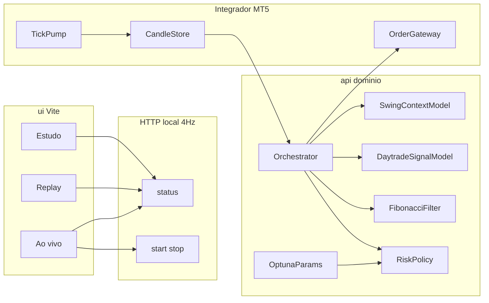

# Koletivo Trader — plano e arquitetura

Remake do `trader-api` em Clean Architecture: `ui/` (clone visual Koletivo) + `api/` (3 MLs, orquestrador, MT5) + `datasets/` WIN$. O card de sinal **sempre** mostra tipo de gráfico (passado e previsto nos próximos 15 min), % de acerto e uma frase — inclusive em “não fazer nada”.

Não é recomendação de investimento. Resultado passado não garante resultado futuro.

## Origem e marca

- Workspace: `C:\src\koletivo-trader`
- Fonte operacional: `C:\src\trader-api` (`arthurmb98/trader-api`, branch `staging`) — sessão WIN, `protect_levels`, config `best_candles_m5_1000_a` (M5, stop 100 / gain 200, trailing 60/50, ouro, 8 trades/dia). A ML deles (regressão linear ~48–49% de direção) **não** é o modelo daqui.
- **Koletivo Hub**: [koletivo-hub.vercel.app](https://koletivo-hub.vercel.app) (`arthurmb98/koletivo-web`). Só marca (Syne/Outfit, `#058ef2`).
- GitHub público: [arthurmb98/koletivo-trader](https://github.com/arthurmb98/koletivo-trader), branch **`staging`**. `.env` e `journal/` fora do Git.

## Layout

```
koletivo-trader/
  ui/                 # React 19 + Vite + Tailwind
  api/                # Python, domínio, ML, orquestrador, MT5, HTTP
  datasets/           # WIN$ M1 e M5
  configs/            # YAML (bancas, stop/gain, pesos)
  studies/            # joblib + studies.json
  journal/            # diário CSV (runtime, gitignored)
  docs/               # este plano e ML
```

Orquestrador e MT5 **sempre locais**. `api/functions/` só proxy fino.

## Arquitetura



Camadas em `api/src/koletivo_trader/`: `domain`, `application`, `ml`, `adapters/mt5`, `adapters/http`, CSV/journal/YAML.

Testes pytest no domínio (sem leakage, fusão de pesos, Fib). Sem `order_send` em teste.

## Tipos

**Dia (swing, D-1 e previsão de D):** `trend_up`, `trend_down`, `normal`, `normal_variation`, `neutral`, `non_trend`, `volatile`.

**Gráfico curto (15×M1 ≈ 3×M5):** `impulse_up/down`, `pullback_up/down`, `consolidation`, `breakout`, `reversal`, `indecision`.

Pré-rótulo determinístico no treino: tipo do passado (feature) e tipo do futuro (alvo). Ao vivo o tipo futuro é **previsto**, nunca lido do preço que ainda não existe.

## Daytrade — 3 entradas

Os **15 M1** são 3 blocos de 5 minutos. Cada bloco:

- 5 vetores no tempo (`datetime`): abertura, máxima, mínima, fechamento → **20 valores**
- 5 volumes no mesmo `datetime` → **5 volumes**

| # | Entrada | Uso |
| --- | --- | --- |
| 1 | Preço passado (3×20 OHLC, normalizado por ATR) | Inferência e treino |
| 2 | Volume passado (15 volumes + padrões) | Inferência e treino |
| 3 | 3 M5 futuros (15 M1 equivalentes) | **Só treino** — rotular gain e `chart_type_future`. Proibido na inferência. |

Padrões de volume (bar volume B3, não tape): confirmação, exaustão, rompimento com RVOL ≥ 1,5×, falso rompimento, absorção, acumulação/distribuição (up vs down volume), liquidez (z-score).

## Daytrade — saídas

- `side`: BUY / SELL / HOLD pela P(gain) na abertura do candle atual no caminho dos próximos 3 M5 (simulação em **M1**, ver [ml.md](ml.md))
- `chart_type` / `chart_type_past`: tipo dos 15 M1 já fechados
- `predicted_chart_type`: tipo previsto dos próximos 15 min
- `hit_pct`, `phrase`

A ordem **não** tem time-stop de 15 min: ao vivo segura até SL/TP. Os 3 M5 são cadência de **decisão**.

## Swing (contexto, peso pode ser zero)

Entrada: M5 do pregão anterior. Saídas o dia inteiro: `swing_signal`, `day_type` (D-1), `predicted_day_type` (D), `swing_hit_pct`.

Não opera sozinho. Com `swing_weight = 0` não entra na fusão nem no veto dos primeiros 15 min.

## Fibonacci (filtro, peso pode ser zero)

Confluência na perna de impulso da sessão: 38,2 / 50 / 61,8. BUY só perto de suporte Fib na direção do daytrade; SELL análogo. Tick WIN = 5 pts. **Não** substitui SL/TP da ordem.

Com `fib_weight = 0` não influencia.

## Fusão: daytrade é o decisor principal

Pesos no YAML (`filters`):

- `swing_weight` ∈ **[0, 0.4]**
- `fib_weight` ∈ **[0, 0.4]**
- **`swing_weight + fib_weight ≤ 0.4`**
- peso do daytrade = `1 - swing_weight - fib_weight` ≥ **0.6**

```
hit_final = w_day * hit_day + w_swing * boost_swing + w_fib * boost_fib
```

- `w_day + w_swing + w_fib = 1`
- Peso **0** = aquele decisor some (o auxiliar pode escolher só daytrade).
- Discordância de swing ou Fib **não** vira veto duro se o peso for 0; só reduz `hit_final` na proporção do peso (pode cair abaixo de `min_hit_pct` → HOLD).
- Primeiros 15 min: exigência de concordância swing×daytrade **somente se** `swing_weight > 0`.

O modelo auxiliar (Optuna/TPE) varre esses pesos (incluindo 0) para ver se o sinal acerta melhor só com daytrade ou com um pouco de swing e/ou Fib. Só grava YAML em `configs/best_bank_*.yaml` — sem `.joblib` de parâmetros.

Também varre stop/gain e `min_hit_pct`. Bancas: 500→1 contrato, 1000→1, +1 a cada R$1000, teto 10. Orquestrador: `best_bank_1000` se existir.

## Orquestrador (Windows / MT5)

1. M5 de D-1 → swing grava `SessionContext`.
2. ARMADO até o ouro (09:15–11:00 e 14:30–17:00).
3. Decisão no **fechamento de M5**; ordem a mercado **já com SL/TP**.
4. Em posição: ticks 20 ms; idle 100 ms; modify SL se muda ≥1 tick e ≥150 ms.
5. Perto do alvo (`invalidate_tp_points` 30 pts): stop para o lado positivo.
6. Demo por padrão (`paper` / `mt5`); `prd` explícito. Idempotência por `bar_id`. Máx. 8 trades/dia.

## Card de sinal (UI)

Sempre, inclusive HOLD:

- Compra / Venda / **Não fazer nada**
- Tipo do gráfico **passado** e tipo **previsto** (próximos 15 min), em PT
- % de acerto (`hit_pct`)
- Frase de domínio (`phrase_for`)

Poll **4 Hz (250 ms)** no sinal e no gráfico (último ponto = `quote.last`).

## Journal CSV

`journal/AAAA-MM-DD/`: `orders.csv` sempre; `trades.csv` + `ledger.csv` só real; `context.json` do swing. Replay **não** grava. Front Ao vivo: default hoje; mínimo = primeiro dia real.

## Datasets

- `WIN_1min_train.csv` (ago/2021–dez/2024), `WIN_1min_test.csv` (jan/2025–ago/2026)
- M5 correspondentes; amostras `WINJ20_*` / `WINM20_*`

Split: treino ≤ 2024, teste ≥ 2025. Optuna na val **2024 H2**, não no teste.

## Stack e CLI

```bash
cd api
pip install -r requirements-windows.txt
pip install -e .
python -m koletivo_trader train
python -m koletivo_trader serve
```

```bash
cd ui && npm install && npm run dev
```

CLI: `train|study|replay|serve|mt5-check`.

## Status

| Bloco | Estado |
| --- | --- |
| Skeleton, domínio, MT5 ARMADO, UI 4 Hz, journal | Feito |
| Repo público `staging` | Feito — [arthurmb98/koletivo-trader](https://github.com/arthurmb98/koletivo-trader) |
| Vetores M1+volume, tipo futuro, Fib por peso, soma ≤ 0,4 | Documentado; código na próxima iteração |
| Modelos swing/daytrade OOS lucrativos | Aberto — [ml.md](ml.md) |
