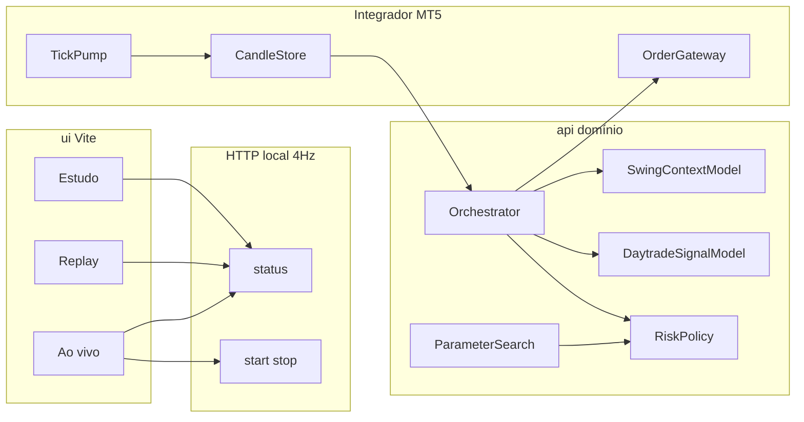

# Koletivo Trader — plano e arquitetura

Remake do `trader-api` em Clean Architecture: `ui/` (clone visual Koletivo) + `api/` (3 MLs, orquestrador, MT5) + `datasets/` WIN$. O card de sinal **sempre** mostra tipo de gráfico, % de acerto prevista e uma frase — inclusive em “não fazer nada”.

Não é recomendação de investimento. Resultado passado não garante resultado futuro.

## Origem e marca

- Workspace: `C:\src\koletivo-trader`
- Fonte: `C:\src\trader-api` (remoto `arthurmb98/trader-api`, branch `staging`)
- Setup de referência ao vivo no trader-api: `best_candles_m5_1000_a` (M5, banca 1000, stop 100 / gain 200, trailing 60/50, `ml_guard`, 1 mini)
- **Koletivo Hub** não é pasta local: [koletivo-hub.vercel.app](https://koletivo-hub.vercel.app) do repo privado `arthurmb98/koletivo-web`. O trader reusa marca (Syne/Outfit, `#058ef2`) e o rodapé do estudo aponta para o hub; não há dependência de código.
- GitHub: conta pessoal `arthurmb98`. Repo alvo público `arthurmb98/koletivo-trader`, branch `staging`, datasets commitados. `.env` e `journal/` fora do Git.

## Layout

```
koletivo-trader/
  ui/                 # React 19 + Vite + Tailwind (clone visual do web/)
  api/                # Python, domínio, ML, orquestrador, MT5, HTTP
  datasets/           # WIN$ M1 e M5
  configs/            # YAML (bancas, stop/gain, pesos, sessão)
  studies/            # artefatos de treino (joblib + JSON)
  journal/            # diário operacional (CSV, 1 pasta por dia; fora do Git)
  docs/               # este plano e notas de ML
```

A pasta `ui/` **não fica vazia**. Functions serverless em `api/functions/` são adaptadores finos; orquestrador e MT5 **sempre locais**.

## Arquitetura da API (hexagonal)



Camadas em `api/src/koletivo_trader/`:

| Camada | Papel |
| --- | --- |
| `domain` | `Candle`, `Side` (BUY/SELL/HOLD), `DayType`, `ChartType`, `Signal` (lado + tipo + hit_pct + phrase), `SessionContext`, risco e sessão |
| `application` | `LiveEngine`, replay, `train_models` |
| `ml` | swing, daytrade, busca Optuna |
| `adapters/mt5` | único lugar que importa `MetaTrader5` |
| `adapters/http` | FastAPI local; `api/functions/` só proxy |
| `adapters` | CSV, journal, configs YAML |

Testes: pytest no domínio (rótulos sem vazamento de futuro), journal e fusão. Sem `order_send` em teste.

## Correções de mercado (vs. trader-api)

O trader-api prevê o próximo OHLC com regressão linear em 1 candle e deriva compra/venda. Acerto direcional no estudo ~48–49%. A borda está em risco/filtros, não na direção. Isso **não** entrega probabilidade calibrada nem tipo de dia.

Ajustes alinhados a Market Profile / auction market / price action:

- Regressão linear entra como **descritor de forma** (inclinação e R², normalizada por ATR), não como classificador único.
- Classificador `HistGradientBoosting` para direção e tipos. A UI precisa de **% de acerto prevista**.
- Features **normalizadas por range/ATR** (sem preço absoluto do WIN).
- Rótulos usam o futuro **só no treino**. Inferência ao vivo nunca vê os 3 M5 seguintes.
- Split: treino até 2024, teste a partir de 2025.
- “ML auxiliar de parâmetros” = **Optuna/TPE** em stop, gain, piso de confiança e `swing_weight` — não uma rede extra.

Detalhes de rótulos, vieses de backtest e o que já falhou estão em [ml.md](ml.md).

### Tipos de dia (swing, D-1 e previsão de D)

- `trend_up` / `trend_down`
- `normal`
- `normal_variation`
- `neutral`
- `non_trend`
- `volatile`

### Tipos de gráfico curto (15×M1 ≈ 3×M5)

- `impulse_up` / `impulse_down`
- `pullback_up` / `pullback_down`
- `consolidation`
- `breakout`
- `reversal`
- `indecision`

## Os 3 modelos

### 1. Swing (não opera sozinho)

Entrada: todos os M5 do **pregão anterior**.

Saídas persistidas o dia inteiro (`SessionContext`):

- `swing_signal`: BUY | SELL | HOLD
- `day_type` (D-1)
- `predicted_day_type` (D)
- `swing_hit_pct`

### 2. Daytrade (crítico, tempo real)

Entrada viva: **15 candles M1** = 60 valores OHLC (+ features de estrutura e M5 anteriores já fechados). Objetivo: decisão para o **próximo bloco de 3 M5**, entrada na **abertura** do próximo M5.

Saída viva: `side`, `chart_type`, `hit_pct`, `phrase`.

A ordem **não** tem time-stop de 15 minutos: ao vivo a posição fica até SL/TP, com trailing. O horizonte de 3 M5 é a **cadência de decisão**, não o tempo máximo de hold. Backtest que só olha 3 M5 subestima o sistema — ver [ml.md](ml.md).

### 3. Busca de parâmetros (auxiliar)

Parte da melhor config do trader-api (`point_value=0.20`, `tick_size=5`, `contract_cost=1`, stop 100 / gain 200, trailing, ouro 09:15–11:00 e 14:30–17:00).

Varre stop/gain, `min_hit_pct`, `swing_weight` ∈ (0, 1) começando em **0.15**.

Contratos:

- 500 → 1
- 1000 → 1
- +1 a cada R$ 1000, teto 10

Gera YAML por banca (`configs/best_bank_{500,1000,5000}.yaml`). O orquestrador carrega `best_bank_1000` se existir; senão `best_candles_m5_1000_a`.

## Orquestrador (Windows / MT5)

Antes do ouro (ou ao armar):

1. Integrador busca M5 de D-1 no MT5 (fallback: CSV).
2. Swing grava `SessionContext`.
3. Motor fica ARMADO até 09:15.

Loop:

- Decisão **só no fechamento de M5**. Ticks servem mark-to-market, trailing e rejeição de ordem velha.
- **ARMADO** envia **ordem a mercado já com SL/TP**.
- Em posição: poll de ticks **20 ms**; idle **100 ms**. `modify_sltp` só se o stop muda ≥1 tick e ≥**150 ms** desde o último modify.
- Perto do alvo (`invalidate_tp_points`, 30 pts): puxa o stop para o lado positivo para um dunk ainda travar lucro.
- Circuito: reconnect, heartbeat, recusa de conta real por padrão (`paper` / `mt5` demo); `prd` só explícito.
- Ordens idempotentes (magic + comment + bar_id). Sem reenvio no mesmo M5.
- Limites: `max_trades_per_day=8`, `daily_loss_points`.

Fusão swing + daytrade:

- **Primeiros 15 min**: só opera se daytrade e swing concordarem; senão HOLD.
- **Depois**: `hit_final = (1 - w) * hit_day + w * boost`, `w = swing_weight`.
  - Chart combina com `predicted_day_type` → boost.
  - Discorda → penaliza; pode cair abaixo do piso → HOLD.

## Card de sinal (UI)

O snapshot HTTP e o card “Sinal atual” **sempre** mostram, mesmo em HOLD:

- Lado: Compra / Venda / **Não fazer nada**
- Tipo do gráfico (`chart_type` em PT)
- % de acerto prevista (`hit_pct`)
- Frase gerada no domínio (`phrase_for`), não string solta no React

Poll do front: **4 Hz (250 ms)** para sinal **e** gráfico de preço (último ponto = `quote.last`). Integrador continua em tick-rate.

## Journal CSV

`journal/AAAA-MM-DD/` (America/Sao_Paulo):

| Arquivo | Quando |
| --- | --- |
| `orders.csv` | sempre (paper, demo, real), inclusive HOLD |
| `trades.csv` | só `mt5`/`prd` com fill |
| `ledger.csv` | só operação real |
| `context.json` | SessionContext do swing |

Replay **não** grava journal.

Front em Ao vivo: default **hoje**; mínimo = primeiro dia real (`trades.csv` ou `ledger.csv`). Data antiga é estática; só o dia corrente faz poll 4 Hz.

## Front

Rotas:

- `/` estudo (`ui/public/studies.json`)
- `/replay` CSV histórico, sem ordem e sem journal
- `/ao-vivo` arma MT5 local; default hoje

Comunicação: GET status 4 Hz + POST start/stop + GET journal. Sem WebSocket.

## Datasets

Copiados de `trader-api/datasets`:

- `WIN_1min_train.csv` (~30 MB, ago/2021–dez/2024)
- `WIN_1min_test.csv` (~15 MB, jan/2025–ago/2026)
- `WIN_5min_train.csv` / `WIN_5min_test.csv`
- amostras `WINJ20_*` / `WINM20_*`

Dumps brutos `WIN$D(M1).csv` / `WIN$D(M5).csv` não estavam no disco. Se o MT5 Genial/Clear estiver aberto, `copy_rates_range` pode atualizar.

## Stack e CLI

- Python 3.11+, FastAPI, pandas, scikit-learn, Optuna, joblib, MetaTrader5 (Windows)
- UI: React 19, Vite, Tailwind, Recharts
- CLI: `python -m koletivo_trader train|study|replay|serve|mt5-check`

```bash
cd api
pip install -r requirements-windows.txt
pip install -e .
python -m koletivo_trader train
python -m koletivo_trader serve
```

```bash
cd ui
npm install
npm run dev
```

## Status da implementação

| Bloco | Estado |
| --- | --- |
| Skeleton `ui/` + `api/` hexagonal + configs + datasets | Feito |
| Domínio, fusão, risco, sessão, testes | Feito (pytest verde) |
| Integrador MT5 + orquestrador ARMADO | Feito |
| API 4 Hz + front clone + card de sinal | Feito |
| Journal CSV + seletor de data | Feito |
| Pipeline ML (rótulos, two-stage, Optuna em val 2024 H2) | Em iteração — ver [ml.md](ml.md) |
| Estratégia OOS 2025–2026 altamente lucrativa | **Aberto** |
| Repo público `arthurmb98/koletivo-trader` branch `staging` | Pendente |
