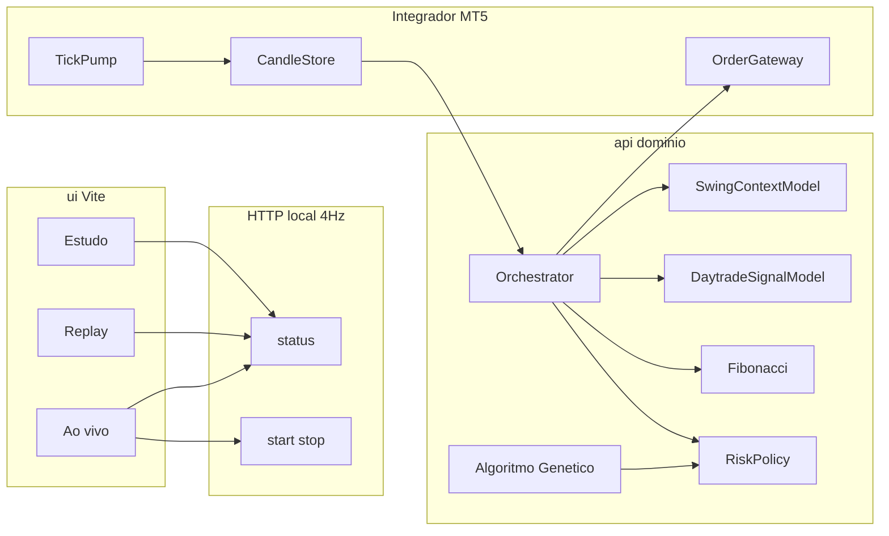

# Koletivo Trader — plano e arquitetura

Remake do `trader-api` em Clean Architecture: `ui/` (clone visual Koletivo) + `api/` (ML de gráfico, AG de parâmetros, orquestrador, MT5) + `datasets/` WIN$. O card de sinal **sempre** mostra tipo de gráfico (passado e previsto nos próximos 15 min), % de acerto e uma frase — inclusive em “não fazer nada”.

Não é recomendação de investimento. Resultado passado não garante resultado futuro.

## Origem e marca

- Workspace: `C:\src\koletivo-trader`
- Fonte operacional: `C:\src\trader-api` (`arthurmb98/trader-api`, branch `staging`) — sessão WIN, `protect_levels`, config semente `best_candles_m5_1000_a` (M5, stop 100 / gain 200, trailing 60/50, ouro, 8 trades/dia). A ML deles (regressão linear ~48–49% de direção) **não** é o modelo daqui.
- **Koletivo Hub**: [koletivo-hub.vercel.app](https://koletivo-hub.vercel.app) (`arthurmb98/koletivo-web`). Só marca (Syne/Outfit, `#058ef2`).
- GitHub público: [arthurmb98/koletivo-trader](https://github.com/arthurmb98/koletivo-trader), branch **`staging`**. `.env` e `journal/` fora do Git.

## Layout

```
koletivo-trader/
  ui/                 # React 19 + Vite + Tailwind
  api/                # Python, domínio, ML, AG, orquestrador, MT5, HTTP
  datasets/           # WIN$ M1 e M5
  configs/            # YAML (bancas, stop/gain, pesos, offset)
  studies/            # joblib das MLs + studies.json
  journal/            # diário CSV (runtime, gitignored)
  docs/               # este plano e ML
```

Orquestrador e MT5 **sempre locais**. `api/functions/` só proxy fino.

## Arquitetura



Camadas em `api/src/koletivo_trader/`: `domain`, `application`, `ml` (modelos + `genetics.py`), `adapters/mt5`, `adapters/http`, CSV/journal/YAML.

Dois papéis distintos:

- **ML** — padrão de gráfico e sinal (swing + daytrade). Treina uma vez no split 2024/2025.
- **AG** — parâmetros de **decisão** (stop, gain, `min_hit_pct`, `swing_weight`, `fib_weight`, `offset_points`). Não substitui a ML. Não gera rede de parâmetros. Só YAML.

Testes pytest no domínio (sem leakage, fusão aditiva, Fib, offset). Sem `order_send` em teste.

## Tipos

**Dia (swing, D-1 e previsão de D):** `trend_up`, `trend_down`, `normal`, `normal_variation`, `neutral`, `non_trend`, `volatile`.

**Gráfico curto (15×M1 ≈ 3×M5):** `impulse_up/down`, `pullback_up/down`, `consolidation`, `breakout`, `reversal`, `indecision`.

Não há treino nem UI de operação em 1 min, nem caso “último candle”. M1 só monta o tensor da estratégia de **últimos candles em 5 min**. Só a banca muda (500, 1000, 5000, 10000).

Pré-rótulo determinístico no treino: tipo do passado (feature) e tipo do futuro (alvo). Ao vivo o tipo futuro é **previsto**, nunca lido do preço que ainda não existe.

## Daytrade — 3 entradas

Os **15 M1** são 3 blocos de 5 minutos. Cada bloco: 5 vetores `(t, O, H, L, C)` + 5 volumes.

| # | Entrada | Uso |
| --- | --- | --- |
| 1 | Preço passado (ATR-normalizado) | Inferência e treino |
| 2 | Volume passado + assinaturas | Inferência e treino |
| 3 | 3 M5 futuros (15 M1) | **Só treino** — Y de gain e `chart_type_future` |

Padrões de volume: confirmação, exaustão, rompimento com RVOL ≥ 1,5×, falso rompimento, absorção, A/D, liquidez (z-score).

## Daytrade — saídas

- `side`: BUY / SELL / HOLD pela P(gain)
- `chart_type`: tipo dos 15 M1 já fechados
- `predicted_chart_type`: tipo previsto dos próximos 15 min
- `hit_pct`, `phrase`

A ordem **não** tem time-stop de 15 min: ao vivo segura até SL/TP. Os 3 M5 são cadência de **decisão**.

## Swing (contexto)

Entrada: M5 do pregão anterior. Saídas o dia inteiro: `swing_signal`, `day_type` (D-1), `predicted_day_type` (D), `swing_hit_pct`.

Não opera sozinho. Com `swing_weight = 0` não entra na fusão.

## Fibonacci

Confluência 38,2 / 50 / 61,8 na perna da sessão. Score assinado em [−1, 1]: positivo perto do Fib a favor do lado do daytrade, negativo contra. Tick WIN = 5 pts. **Não** substitui SL/TP. Com `fib_weight = 0` some.

## Fusão (daytrade é o decisor)

O `%` do daytrade **não** é diluído numa média. Swing e Fib só deslocam o hit na proporção do peso:

```
w_swing, w_fib ∈ [0, 0.4]
w_swing + w_fib ≤ 0.4
hit_final = hit_day + w_swing * signed_swing + w_fib * signed_fib
```

- Concordância: `signed = +confiança` (ex. swing 80% no mesmo lado).
- Discordância: `signed = −confiança`.
- Exemplo: hit 96%, swing discorda a 80% com peso 0,2 → `0,96 − 0,16 = 0,80`. O sinal permanece se `hit_final ≥ min_hit_pct`.
- Peso **0**: aquele decisor não existe (daytrade sozinho, ou só com um auxiliar). O AG escolhe o modo.
- Não há veto binário nos primeiros 15 min.

## Offset de entrada

`execution.offset_points` (tick 5):

- `0` — entra no fechamento (ou abertura do próximo M5 no replay) do último candle
- `+N` / `−N` — desloca a entrada; o AG explora o intervalo típico [−50, +50]

Stop e gain são medidos **a partir dessa entrada**, não do close cru.

## Algoritmo genético

Arquivo: `api/src/koletivo_trader/ml/genetics.py`.

Genoma: stop, gain (RR ≥ 1,5), `min_hit`, `swing_weight`, `fib_weight`, `offset_points`.

Técnica: GA real-codificado, SBX, mutação polinomial, torneio, elitismo, imigração ocasional, early-stop se a elite estabilizar. Uma MLP pequena **só ranqueia** candidatos não avaliados para reduzir backtests — não opera e não substitui swing/daytrade.

Fitness: walk-forward purged (3 folds + embargo) na val **2024 H2**. Holdout de confirmação no fim da val. Teste 2025+ **não** entra na busca.

Como esses genes não treinam o HGB do daytrade, **não há retreino de ML por geração** — só replay do sinal já previsto. O swing usa semente 100/200 uma vez no `train`.

Saída: `configs/best_bank_{500,1000,5000,10000}.yaml`. Caso e tempo gráfico são fixos (últimos candles, M5). Bancas: 500→1 contrato, 1000→1, +1 a cada R$ 1000, teto 10 (banca 10k).

## Orquestrador (Windows / MT5)

1. M5 de D-1 → swing grava `SessionContext`.
2. ARMADO até o ouro (09:15–11:00 e 14:30–17:00).
3. Decisão no **fechamento de M5**; ordem a mercado **já com SL/TP**, preço `close + offset`.
4. Em posição: ticks 20 ms; idle 100 ms; modify SL se muda ≥1 tick e ≥150 ms.
5. Perto do alvo (`invalidate_tp_points` 30 pts): stop para o lado positivo.
6. Demo por padrão (`paper` / `mt5`); `prd` explícito. Idempotência por `bar_id`. Máx. 8 trades/dia.

## Card de sinal (UI)

Sempre, inclusive HOLD:

- Compra / Venda / **Não fazer nada**
- Tipo do gráfico **passado** e tipo **previsto** (próximos 15 min), em PT
- % de acerto (`hit_pct`)
- Frase de domínio (`phrase_for`)

Poll **4 Hz (250 ms)**.

## Journal CSV

`journal/AAAA-MM-DD/`: `orders.csv` sempre; `trades.csv` + `ledger.csv` só real; `context.json` do swing. Replay **não** grava. Front Ao vivo: default hoje; mínimo = primeiro dia real.

## Datasets

- `WIN_1min_train.csv` (ago/2021–dez/2024), `WIN_1min_test.csv` (jan/2025–ago/2026)
- M5 correspondentes

Split: treino ≤ 2024, teste ≥ 2025. AG na val **2024 H2**, não no teste.

## Stack e CLI

```bash
cd api
pip install -r requirements-windows.txt
pip install -e .
python -m koletivo_trader train
python -m koletivo_trader serve
```

```bash
cd ui && npm install && npm run dev
```

CLI: `train|study|replay|serve|mt5-check`.

## Status

| Bloco | Estado |
| --- | --- |
| Skeleton, domínio, MT5 ARMADO, UI 4 Hz, journal | Feito |
| Repo público `staging` | Feito — [arthurmb98/koletivo-trader](https://github.com/arthurmb98/koletivo-trader) |
| Blocos 5×M1 + volume, Fib assinado, fusão aditiva, offset | Feito |
| AG no lugar da busca Optuna; YAML por banca | Feito no código (`ml/genetics.py`) |
| `train` com AG + front local para ver estudo | Rodar `python -m koletivo_trader train` e `serve` |
